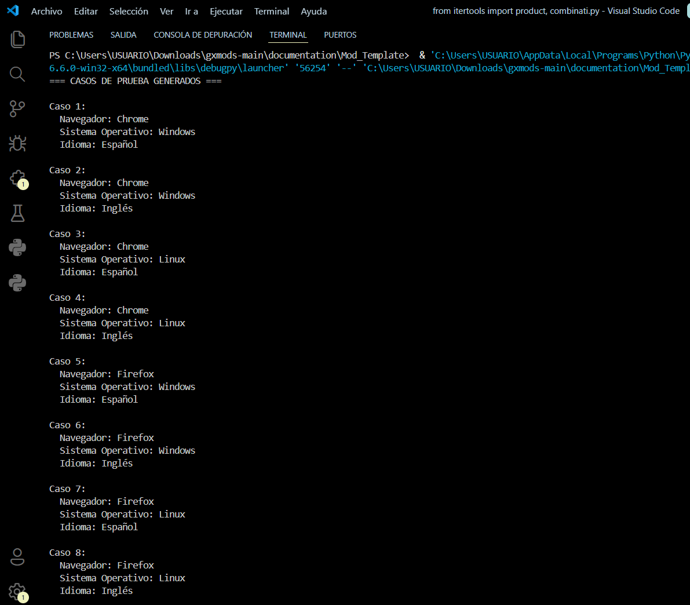

# Diseño de Pruebas Combinatorias para QA

## Descripción
Este proyecto presenta una implementación práctica de pruebas combinatorias aplicadas al aseguramiento de calidad de software (QA), utilizando técnicas como Pairwise Testing y All-Pairs.

La investigación se fundamenta en principios de:
- Lógica proposicional
- Teoría de conjuntos
- Optimización de casos de prueba
- Cobertura de testing

## Objetivo
Analizar la importancia del diseño de pruebas combinatorias en el aseguramiento de calidad de software considerando la optimización de casos de prueba y la detección eficiente de errores.

## Tecnologías utilizadas
- Python
- GitHub
- Pairwise Testing
- All-Pairs
- QA Testing

## Fundamento matemático
La lógica proposicional permite representar condiciones y validaciones dentro de los casos de prueba.

La teoría de conjuntos se utiliza para organizar parámetros, subconjuntos y combinaciones necesarias para la generación eficiente de pruebas.

## Estructura del proyecto

```bash
qa-combinatorial-testing/
│
├── README.md
├── src/
├── docs/
├── examples/
└── images/
```

## Autor
Bryan Alex

## Monografía
Repositorio desarrollado como parte de la investigación académica sobre diseño de pruebas combinatorias y optimización del aseguramiento de calidad de software.

